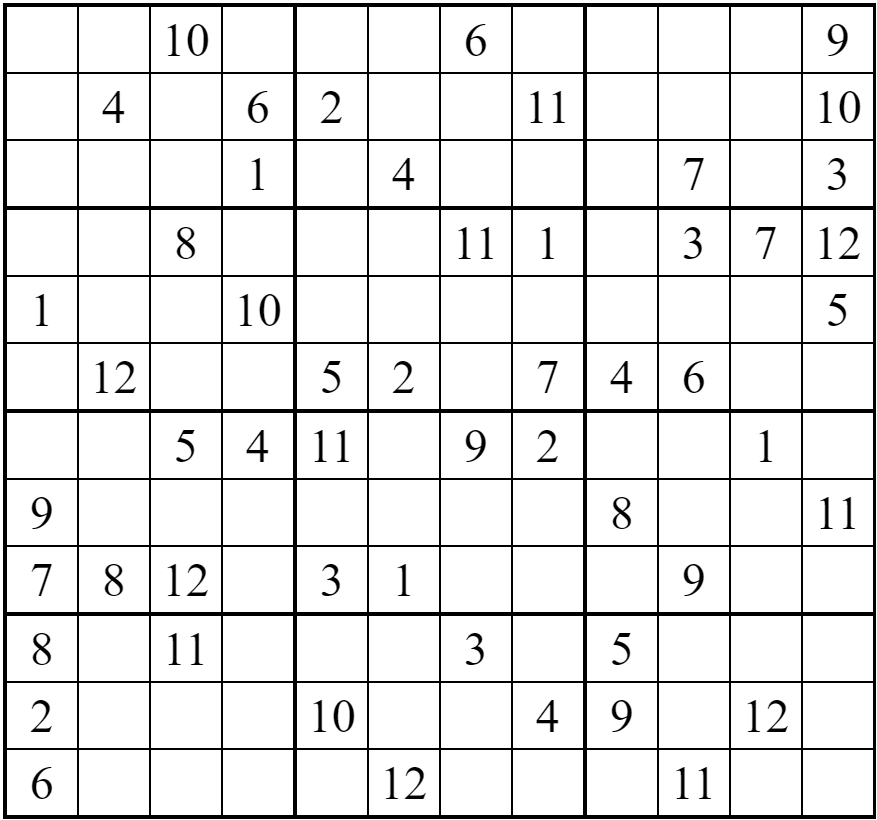
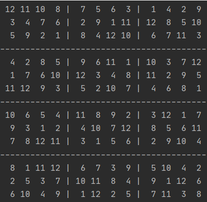

# MXN Sudoku generator and solver
Sudoku is a logic-based, combinatorial number-placement puzzle. In classic sudoku, the objective is to fill a 9×9 grid with digits so that each column, each row, and each of the nine 3×3 sub-grids that compose the grid contain all of the digits from 1 to 9.

Extending the idea of the classical 9×9 grid sudoku puzzle, this simple program written in Python can generate as well as solve any valid grid size of sudoku puzzle with a sub-grid size of M×N.

## An example Sudoku Probelm:

## Solution to the puzzle:

